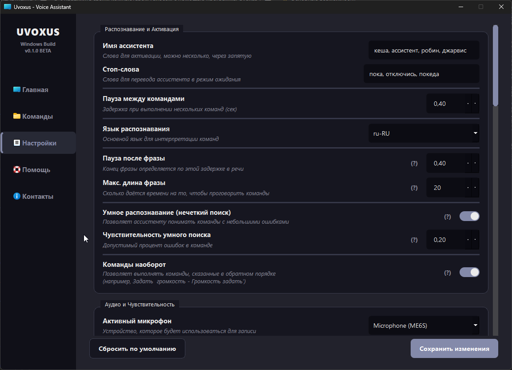
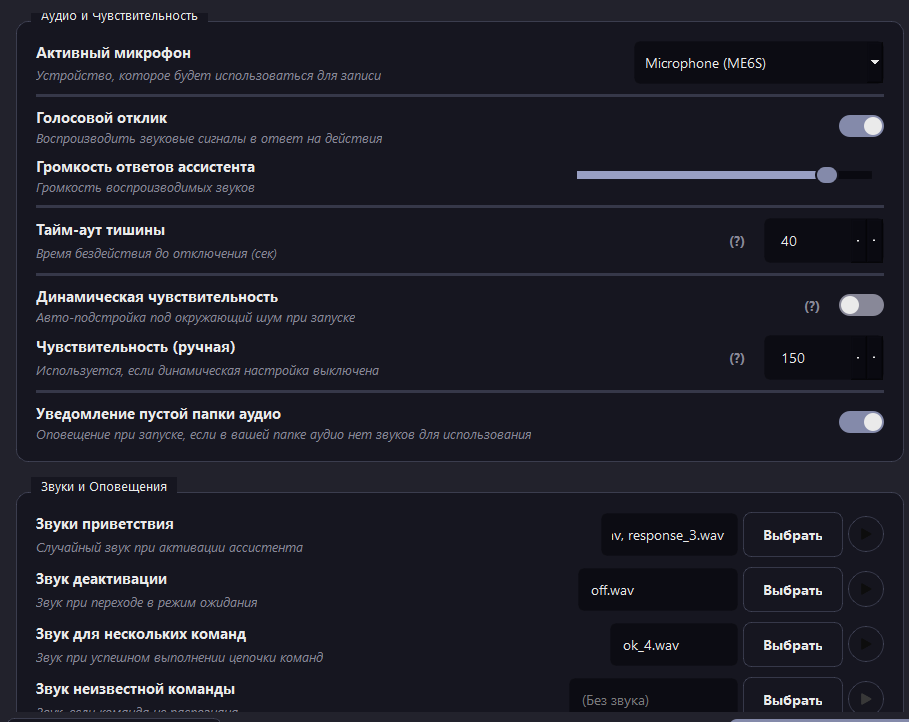

# 🗣 Управляйте своим компьютером голосом с помощью программы Uvoxus

## 🗺️ Навигация по README

- [Введение](#📝-введение)
- [Основные возможности](#🌟-основные-возможности)
- [Дополнительные функции](#🛠️-дополнительные-функции)
- [Персонализация звуковых ответов](#🔊-персонализация-звуковых-ответов)
- [Поддерживаемые системы](#🖥️-поддерживаемые-системы)
- [Скачать](#📥-скачать)
- [Важная информация](#⚠️-важная-информация)
- [Настройка и первый запуск](#⚙️-настройка-и-первый-запуск)
- [Как поддержать проект](#💬-как-поддержать-проект)
- [Контактная информация](#📇-контактная-информация)

---

## 📝 Введение

Добро пожаловать в **Uvoxus Voice Assistant** — умного и гибкого голосового помощника, созданного для того, чтобы сделать ваше взаимодействие с компьютером под управлением Windows максимально комфортным и быстрым. Управляйте системой, приложениями, медиа и многим другим с помощью простых голосовых команд.

Ассистент имеет современный интерфейс и широкие возможности кастомизации: от создания простых команд для открытия папок до написания сложных сценариев, автоматизирующих повседневные задачи.

Проект постоянно развивается, получает обновления для повышения стабильности и добавления новых функций.

### Локализация

Программа пока не имеет встроенной системы локализаций, но поддерживает **русскую и английскую речь**.

---

В мире, где большинство полезных программ переходят на модель подписки, ограничивая функции за ежемесячную плату, **Uvoxus Voice Assistant** следует другому пути.

Этот ассистент — результат энтузиазма и стремления создать по-настоящему удобный инструмент, **доступный каждому**.

* ✅ **Без подписок:** Никаких ежемесячных платежей — установите один раз и пользуйтесь без ограничений.  
* ✅ **Все функции доступны сразу:** Никаких “Pro” или “Premium” версий — всё доступно с первого запуска.  
* ✅ **Без рекламы:** Ничто не будет отвлекать вас от работы.  
* ✅ **Бесплатные обновления:** Все обновления будут абсолютно бесплатны

🎯 **Моя цель — дать вам инструмент, а не продать продукт.**

---

## 🌟 Основные возможности

<table style="border-spacing: 25px; text-align: center; width: 100%;">
  <tr>
    <td valign="top" width="33%">
      <b>🖥️ Главный экран</b> 
       
      
Здесь отображается лог событий и текущее состояние ассистента. 
      Это ваш центр управления.

    </td>
    <td valign="top" width="33%">
      <b>🗂️ Команды</b> 
       
      
Управляйте всеми вашими командами и сценариями. 
      Создавайте, редактируйте и тестируйте их в одном месте.

    </td>
    <td valign="top" width="33%">
      <b>⚙️ Настройки</b> 
       
       
      
Настраивайте ассистента под себя: имя, язык распознавания, задержки, 
      активацию умного распознавания и многое другое.

    </td>
  </tr>

  <tr>
    <td valign="top" width="33%">
      <b>🚀 Пользовательские команды</b> 
       
      
Включайте или отключайте как всю вкладку встроенных команд, 
      так и отдельные из них. Эта вкладка содержит предустановленные команды, 
      созданные разработчиком. Здесь вы можете изменить параметры команды 
      или отключить её, если она вам не нужна.

    </td>
    <td valign="top" width="33%">
      <b>🚀 Встроенные команды</b> 
       
      
Создавайте собственные команды для запуска программ, 
      открытия папок, сайтов или нажатия клавиш.

    </td>
    <td valign="top" width="33%">
      <b>📜 Сценарии</b> 
       
      
Объединяйте несколько действий в одну команду. 
      Например, сценарий <i>"Я дома"</i> может включить музыку, 
      открыть VS Code и установить яркость экрана на 100%.

    </td>
  </tr>

  <tr>
    <td valign="top" width="33%">
      <b>🎨 Темы интерфейса</b> 
       
      
Настраивайте внешний вид под себя: 
      выберите готовую тему или создайте собственную цветовую схему.

    </td>
    <td valign="top" width="33%">
      <b>📋 Лог событий</b> 
       
      
Просматривайте историю действий ассистента. 
      Можно отключить ненужные записи и оставить только важные.

    </td>
    <td valign="top" width="33%">
      <b>📊 Интеграция с системой</b> 
       
      
Настройте автозапуск с Windows и сворачивание в трей — 
      ассистент будет всегда готов к работе.

    </td>
  </tr>

  <tr>
    <td valign="top" colspan="3">
      <b>📥 Импорт и экспорт</b> 
       
      
Сохраняйте все настройки, команды и сценарии в один файл — 
      для резервного копирования или переноса на другой ПК.

    </td>
  </tr>
</table>

---

## 🛠️ Дополнительные функции

- 🌐 **Управление браузером:** Открывайте, закрывайте и переключайте вкладки, прокручивайте и обновляйте страницы голосом.  
- ⌨️ **Эмуляция клавиатуры:** Настраивайте команды для нажатия любых клавиш или их сочетаний (например, `Ctrl + S`).  
- 💻 **Консольные команды:** Выполняйте системные команды Windows прямо из ассистента, включая скрытый режим.  
- 📂 **Быстрый доступ:** Мгновенно открывайте системные папки — «Загрузки», «Документы» и другие.  
- 🗑️ **Очистка корзины:** Наведите порядок в системе одной командой.  
- 🖼️ **Скриншоты:** Делайте снимки экрана голосом.  
- 💡 **Подсказки:** На главном экране ассистент подсказывает случайные команды, чтобы вы быстрее освоились.  
- 🎛️ **Управление питанием:** Меняйте схемы электропитания для оптимизации производительности или экономии энергии.  
- 🔆 **Регулировка яркости:** Устанавливайте уровень яркости экрана голосом (для поддерживаемых устройств).  

---

## 🔊 Персонализация звуковых ответов

Сделайте ассистента по-настоящему вашим, добавив собственные звуки отклика!  
Вы можете назначить уникальный аудиофайл на **любую команду или сценарий**.

### Возможности:

* 🎵 **Назначайте звуки** для встроенных и пользовательских команд.  
* 🎤 **Используйте свои файлы:** MP3, WAV или OGG.  
* 🎲 **Случайные ответы:** Задайте несколько звуков — ассистент будет выбирать случайный.  
* 📁 **Аудио-паки:** Разделяйте звуки по подпапкам внутри `audio` для удобной навигации.

### Как это сделать:

1. Найдите папку `audio` рядом с `.exe` файлом.  
2. Добавьте туда свои звуки (можно в подпапки).  
3. В настройках команды или сценария выберите нужный звук через кнопку **"Выбрать"**.  
4. Сохраните изменения — теперь ассистент отвечает вашим уникальным голосом!

💡 **Совет:** запишите фразы вроде «Готово!», «Выполняю!», «Как скажете!» и назначьте их на часто используемые команды. Это сделает взаимодействие более живым.

---

## 🖥️ Поддерживаемые системы

| Система | Поддержка | Примечания |
| :--- | :---: | :--- |
| Linux | ❌ | |
| macOS | ❌ | |
| Windows 7 | ❌ | |
| Windows 8 | ❌ | |
| Windows 10 | ✔️ | Поддерживается |
| Windows 11 | ✔️ | Рекомендуется |

---
## 📥 Скачать

| 📂 **Выбор скачивания**        | 🌐 **Ссылки**                                                                                 |
|--------------------------------|----------------------------------------------------------------------------------------------|
| **Последняя версия**    | [Скачать](https://github.com/Farmerok/Uvoxus-Voice-Assistant/releases/latest) |
| **Другие релизы** | [Смотреть](https://github.com/Farmerok/Uvoxus-Voice-Assistant/releases)             |
---

## ⚠️ Важная информация

> **Антивирус может ошибочно пометить программу как угрозу.**  
> Это связано с тем, что ассистент взаимодействует с системой (эмулирует клавиши, управляет окнами, запускает процессы).  
> Если вы скачали программу из доверенного источника, добавьте её в исключения антивируса.

> **Запуск программы обязателен от имени администратора.**  
> Это нужно, чтобы у ассистента был приоритет при работе с приложениями и он мог корректно выполнять все действия, без ошибок и ограничений.

---

## ⚙️ Настройка и первый запуск

1. **Скачайте и запустите:** Загрузите последнюю версию со страницы релизов, создайте отдельную папку (например, на рабочем столе), поместите туда `.exe` и запустите.  
2. **Откройте настройки:** Перейдите во вкладку **«Настройки»**.  
3. **Выберите микрофон:** Укажите активное устройство для записи.  
4. **Задайте имя:** Впишите одно или несколько имён для активации (например, `Джарвис`, `Ассистент`).  
5. **Сохраните изменения.**  
6. **Готово!** Вернитесь на вкладку **«Главная»** и произнесите имя ассистента — статус изменится на **«СЛУШАЮ…»**, и индикатор начнёт реагировать на ваш голос.

---

✨ Теперь вы готовы управлять своим ПК голосом с помощью **Uvoxus Voice Assistant**!

---

## 💬 Как поддержать проект?

Если вам нравится ассистент, лучшая благодарность — помочь ему стать известнее.  
🌟 **Поставьте ⭐ звезду на [GitHub](https://github.com/Farmerok/Uvoxus-Voice-Assistant)!**

## 📇 Контактная информация

| 💬 **Источник**            | 🌐 **Ссылка**                                                                                 |
|--------------------------------|----------------------------------------------------------------------------------------------|
| **Telegram**                   | [Перейти](https://t.me/insiderkeeps)                                             |
