# 🗣️ Uvoxus Voice Assistant: Управляйте своим ПК голосом

## 🗺️ Навигация
- [Что такое Uvoxus?](#📝-что-такое-uvoxus)
- [Ключевые принципы](#🎯-ключевые-принципы)
- [Команды vs. Сценарии: В чем разница?](#🤔-команды-vs-сценарии-в-чем-разница)
- [Основные возможности](#🌟-основные-возможности)
- [Дополнительные функции](#🛠️-дополнительные-функции)
- [Персонализация звуковых ответов](#🔊-персонализация-звуковых-ответов)
- [Поддерживаемые системы](#🖥️-поддерживаемые-системы)
- [Скачать](#📥-скачать)
- [Важная информация](#⚠️-важная-информация)
- [Первый запуск и настройка](#⚙️-первый-запуск-и-настройка)
- [Как поддержать проект](#💬-как-поддержать-проект)
- [Контактная информация](#📇-контактная-информация)

---

## 📝 Что такое Uvoxus?

**Uvoxus Voice Assistant** — это умный и гибкий голосовой помощник для Windows, созданный для того, чтобы сделать взаимодействие с компьютером быстрым, удобным и интуитивно понятным. Забудьте о рутинных кликах мышью — управляйте системой, приложениями, медиа и рабочими процессами с помощью простых голосовых команд.

Ассистент обладает современным интерфейсом и глубокими возможностями кастомизации: от создания простых команд для открытия папок до написания сложных **сценариев**, автоматизирующих ваши повседневные задачи.

Проект постоянно развивается, получая регулярные обновления для повышения стабильности и добавления новых функций, прислушиваясь к отзывам пользователей.

### 🌐 Движки распознавания
Uvoxus даёт вам выбор между двумя ведущими технологиями распознавания речи:
- **Google Speech Recognition (Требует интернет):** Высокая точность для широкого круга повседневных фраз.
- **VOSK (Работает оффлайн):** Гарантирует полную конфиденциальность и быструю реакцию без необходимости подключения к сети.

Вы также можете включить **гибридный режим**, чтобы использовать сильные стороны обоих движков для максимальной точности.

### Локализация
Программа пока не имеет встроенной системы локализаций, но поддерживает **русскую и английскую речь**.

---

## 🎯 Ключевые принципы

В мире, где ПО всё чаще переходит на подписочную модель, **Uvoxus** следует другому пути. Этот ассистент — результат энтузиазма и стремления создать по-настоящему удобный инструмент, **доступный каждому**.

*   ✅ **Без подписок:** Никаких ежемесячных или скрытых платежей.
*   ✅ **Все функции доступны сразу:** Никаких "Pro" или "Premium" версий.
*   ✅ **Без рекламы:** Ничто не отвлекает вас от работы.
*   ✅ **Бесплатные обновления:** Всегда.

**Моя цель — дать вам мощный инструмент, а не продать очередной продукт.**

---

## 🤔 Команды vs. Сценарии: В чем разница?

Это два ключевых способа автоматизации в Uvoxus.

### 🚀 Одиночные команды
**Команда** — это одно простое действие, привязанное к голосовому триггеру. Идеально подходит для быстрых, атомарных задач.
*   *«Открой браузер»* → Открывает браузер.
*   *«Нажми Enter»* → Нажимает клавишу Enter.
*   *«Запусти фотошоп»* → Запускает `photoshop.exe`.

### 📜 Сценарии
**Сценарий** — это мощная последовательность из нескольких действий, запускаемая одной фразой. Сценарии позволяют автоматизировать целые рабочие процессы.
*   Вы можете менять порядок действий, перетаскивая их в редакторе.
*   Можно добавлять **паузы** между действиями.

**Пример сценария «Рабочий режим»:**
1.  Установить схему питания «Высокая производительность».
2.  Открыть программу VS Code.
3.  **Пауза 2 секунды.**
4.  Открыть сайт GitHub.
5.  Установить громкость на 50%.

---

## 🌟 Основные возможности

<table style="border-spacing: 25px; text-align: center; width: 100%;">
  <tr>
    <td valign="top" width="33%">
      <b>🖥️ Главный экран</b> 
      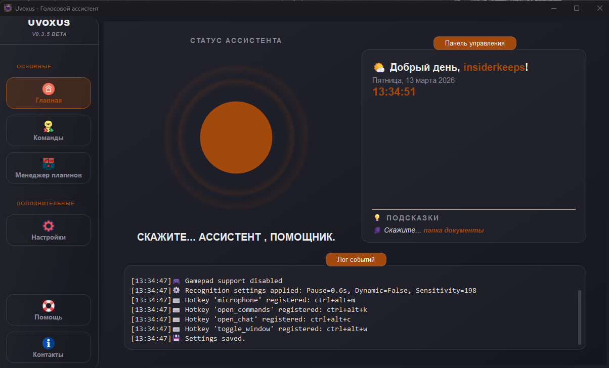 
      
Ваш центр управления. Здесь отображается лог событий и текущий статус ассистента.

    </td>
    <td valign="top" width="33%">
      <b>🗂️ Редактор команд</b> 
      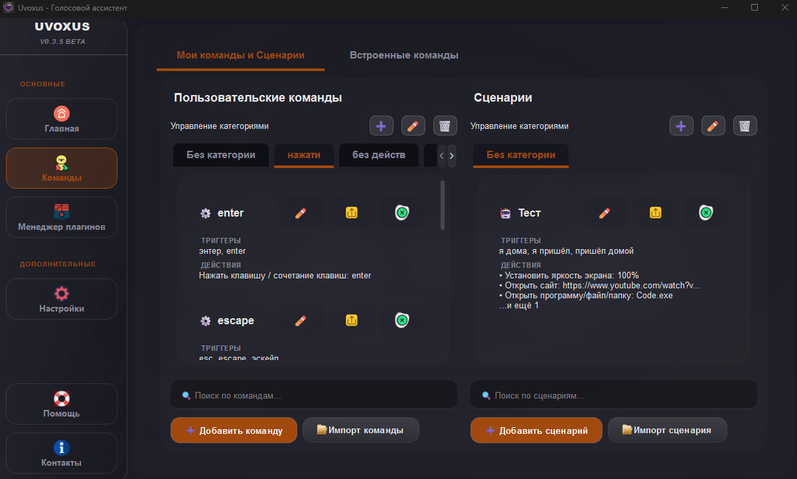 
      
Создавайте, редактируйте и управляйте вашими командами и сценариями в удобном визуальном интерфейсе.

    </td>
    <td valign="top" width="33%">
      <b>⚙️ Гибкие настройки</b> 
      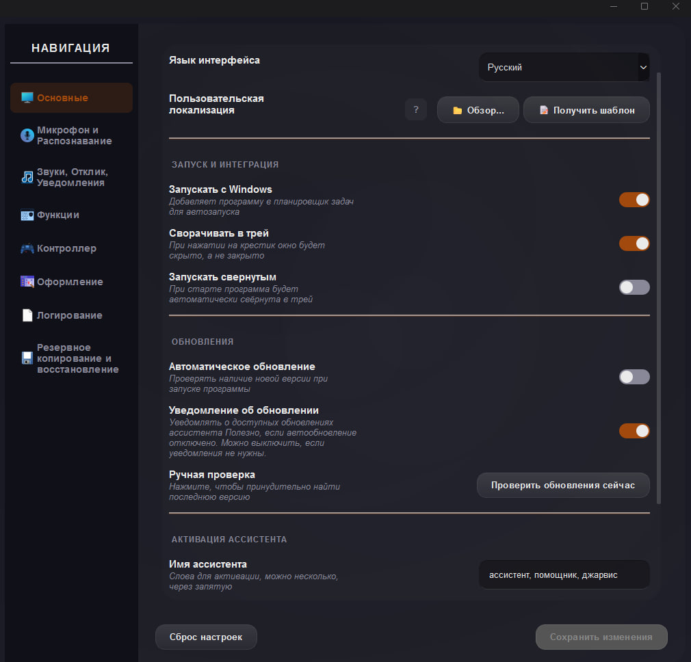 
      
Настройте всё: от имени ассистента и микрофона до движка распознавания и поведения в системе.

    </td>
  </tr>
  <tr>
    <td valign="top" width="33%">
      <b>🚀 Встроенные команды</b> 
      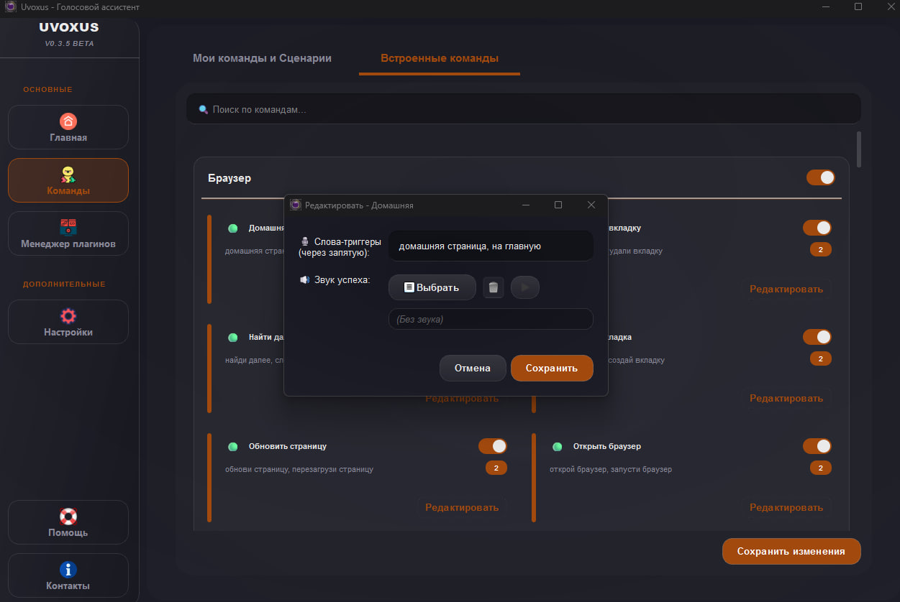 
      
Десятки готовых команд для управления системой. Включайте, отключайте или изменяйте их триггеры под себя.

    </td>
    <td valign="top" width="33%">
      <b>🚀 Одиночные команды</b> 
      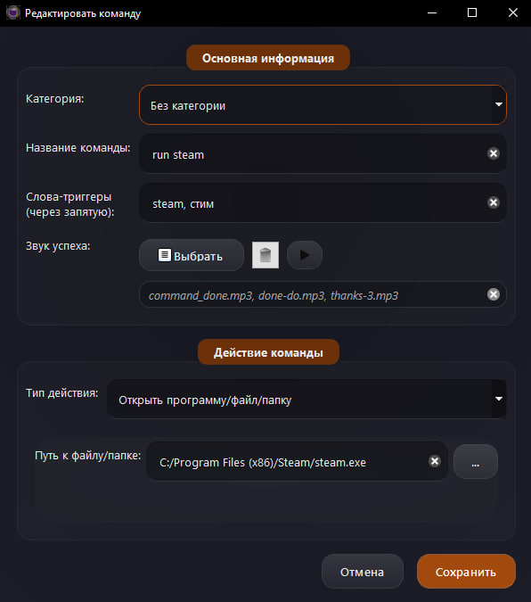 
      
Создавайте собственные простые команды для запуска программ, открытия папок, сайтов или нажатия клавиш.

    </td>
    <td valign="top" width="33%">
      <b>📜 Продвинутые сценарии</b> 
      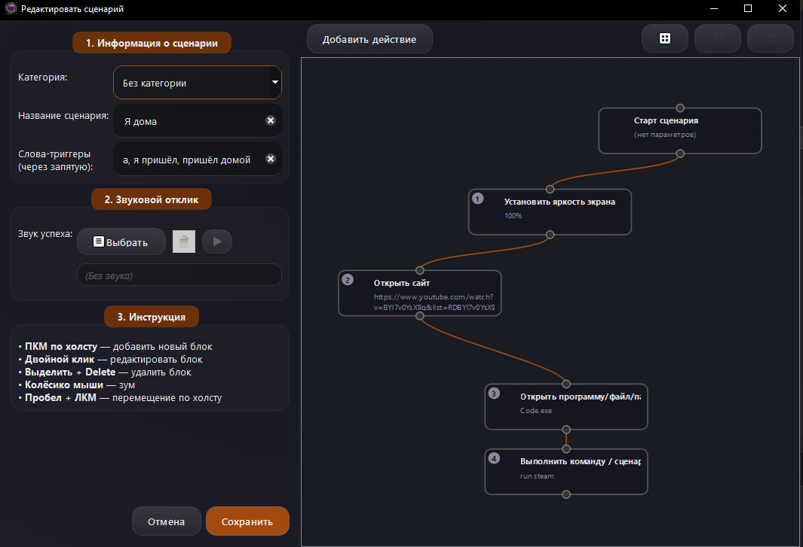 
      
Объединяйте множество действий в один сценарий. Меняйте их порядок, добавляйте паузы и автоматизируйте рутину.

    </td>
  </tr>
  <tr>
    <td valign="top" width="33%">
      <b>💡 Умное распознавание</b> 
      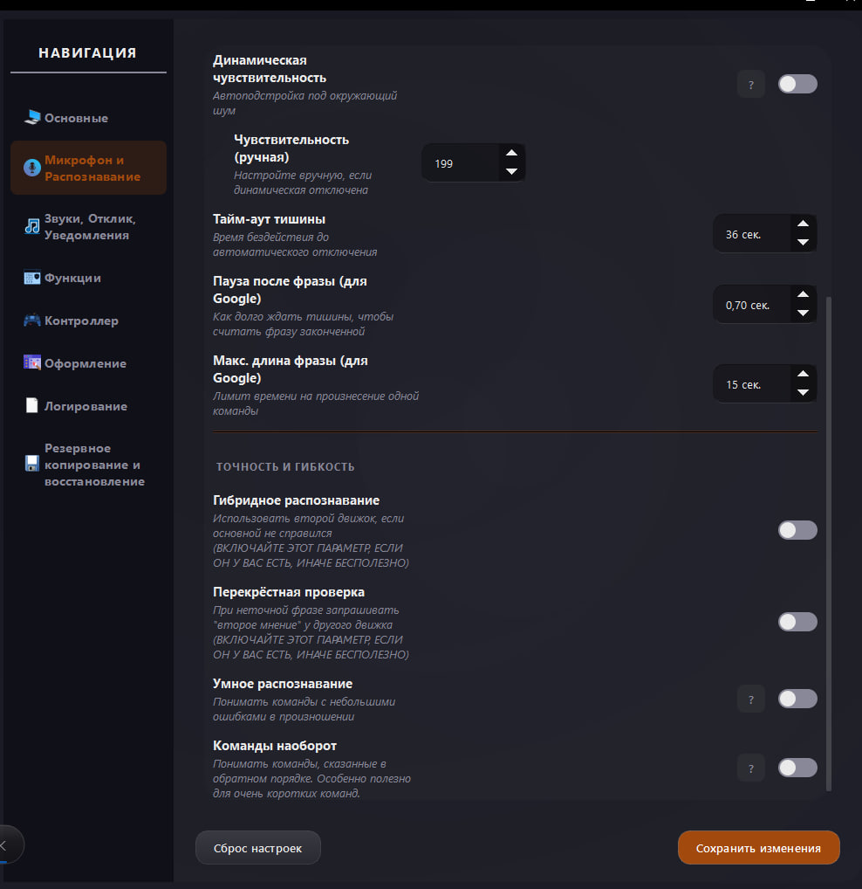 
      
Благодаря гибридному режиму и нечеткому поиску ассистент понимает вас, даже если вы оговорились.

    </td>
    <td valign="top" width="33%">
       <b>🎨 Персонализация тем</b> 
      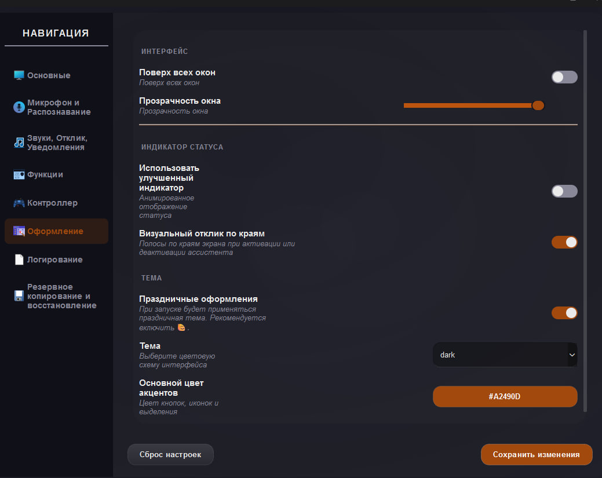 
      
Выберите готовую цветовую схему или создайте собственную, чтобы интерфейс идеально вам подходил.

    </td>
    <td valign="top" width="33%">
      <b>📋 Лог событий</b> 
      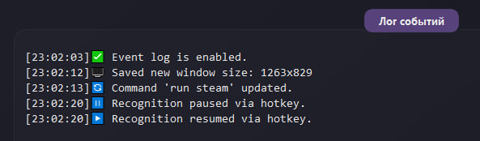 
      
Просматривайте историю действий ассистента, чтобы понимать, как он вас слышит, и быстро исправлять ошибки.

    </td>
  </tr>
  <tr>
    <td valign="top" width="33%">
      <b>📊 Интеграция с системой</b> 
      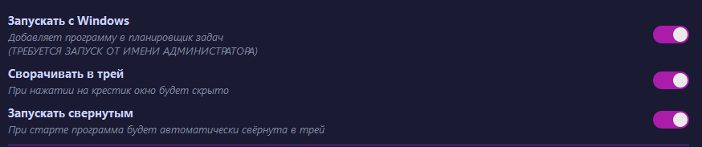 
      
Настройте автозапуск с Windows и сворачивание в трей — ассистент будет всегда под рукой, но не будет мешать.

    </td>
    <td valign="top" width="33%" colspan="2">
      <b>📥 Импорт и экспорт</b> 
      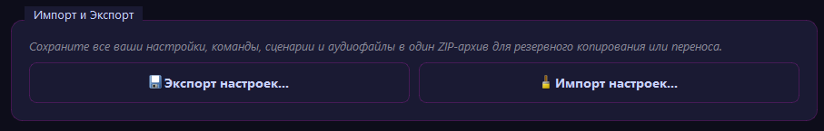 
      
Сохраняйте все настройки, команды и сценарии в один ZIP-файл для резервного копирования или переноса на другой ПК.

    </td>
  </tr>
</table>

---

## 🛠️ Дополнительные функции

-   🌐 **Управление браузером:** Открывайте сайты, новые вкладки, переключайтесь между ними, обновляйте и прокручивайте страницы.
-   ⌨️ **Эмуляция клавиатуры:** Настройте нажатие любых клавиш и сложных сочетаний (`Ctrl + Shift + Esc`), а также диктуйте текст голосом.
-   💻 **Консольные команды:** Выполняйте любые системные команды, в том числе в скрытом режиме без открытия окна консоли.
-   📂 **Быстрый доступ:** Мгновенно открывайте системные папки: «Загрузки», «Документы», «Изображения» и другие.
-   🗑️ **Очистка корзины:** Наведите порядок в системе одной командой.
-   🖼️ **Скриншоты:** Делайте снимки экрана голосом.
-   💡 **Динамические подсказки:** На главном экране ассистент предлагает случайные команды, помогая вам изучить его возможности.
-   🎛️ **Управление питанием:** Меняйте схемы электропитания Windows («Экономия», «Сбалансированная», «Высокая производительность»).
-   🔆 **Регулировка яркости:** Устанавливайте нужный уровень яркости экрана (для поддерживаемых устройств).

---

## 🔊 Персонализация звуковых ответов

Сделайте ассистента уникальным, добавив собственные звуки отклика! Вы можете назначить уникальный аудиофайл или целый набор звуков на **любую команду или сценарий**.

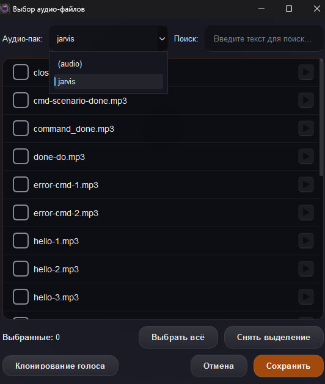

### Возможности:
*   🎵 **Назначайте звуки** как для встроенных, так и для пользовательских команд.
*   🎤 **Используйте свои файлы:** Поддерживаются форматы `MP3`, `WAV`, `OGG`.
*   🎲 **Случайные ответы:** Задайте несколько звуков для одного действия, и ассистент будет выбирать из них случайный.
*   📁 **Аудио-паки:** Организуйте звуки по папкам внутри директории `audio` для удобной навигации в меню.

### Как это сделать:
1.  Найдите папку `audio` рядом с `.exe` файлом программы.
2.  Скопируйте туда свои звуковые файлы (можно создать подпапки для организации).
3.  В редакторе команды или сценария нажмите кнопку **«Выбрать»**.
4.  Сохраните изменения. Теперь ассистент отвечает вашим голосом!

💡 **Совет:** запишите короткие фразы «Готово!», «Выполняю!», «Как скажете!» и назначьте их на часто используемые команды, чтобы сделать взаимодействие более живым.

---

## 🖥️ Поддерживаемые системы

| Система | Поддержка | Примечания |
| :--- | :---: | :--- |
| Linux | ❌ | Не поддерживается |
| macOS | ❌ | Не планируется |
| Windows 7 / 8 | ❌ | Не планируется |
| **Windows 10** | ✔️ | **Полностью поддерживается** |
| **Windows 11** | ✔️ | **Рекомендуется** |

---

## 📥 Скачать

| 📂 **Ресурс** | 🌐 **Ссылка** |
| :--- | :--- |
| **Последняя версия** | [**Скачать с GitHub Releases**](https://github.com/Farmerok/Uvoxus-Voice-Assistant/releases/latest) |
| Все релизы | [История версий](https://github.com/Farmerok/Uvoxus-Voice-Assistant/releases) |

---

## ⚠️ Важная информация

> ### Антивирус может выдать предупреждение
> **Это ложное срабатывание.** Uvoxus — сложная программа, которая глубоко взаимодействует с ОС: эмулирует нажатия клавиш, управляет окнами, запускает и закрывает процессы. Такое поведение может показаться подозрительным для антивирусов, особенно потому, что у бесплатного проекта нет дорогой цифровой подписи.
>
> **Если вы скачали программу с официальной страницы GitHub, она абсолютно безопасна.** Просто добавьте папку с ассистентом в исключения вашего антивируса.

> ### Запуск от имени администратора обязателен
> Это необходимо, чтобы ассистент имел достаточные права для управления другими программами (например, запущенными от имени администратора) и мог корректно выполнять все системные действия без сбоев.

---

## ⚙️ Первый запуск и настройка

1.  **Скачайте и распакуйте:** Загрузите архив с последней версией. Создайте для программы отдельную папку (например, `C:\Uvoxus` или на рабочем столе) и распакуйте туда содержимое.
2.  **Запустите голосового ассистента:** Нажмите 2 раза ЛКМ по `Uvoxus.exe`.
3.  **Откройте настройки:** Перейдите во вкладку **«Настройки»**.
4.  **Выберите микрофон и настройте чувствительность:** В разделе «Аудио и Чувствительность» найдите пункт **«Активный микрофон»** и выберите ваше основное устройство. **Это самый важный шаг!** А также настройте под себя чувствительность.
5.  **Задайте имя:** В настройках на главной странице найдите поле с водом имя асситента и впишите одно или несколько имён для активации (например, `Джарвис`, `Ассистент`).
6.  **Сохраните изменения.**
7.  **Проверьте:** Вернитесь на вкладку **«Главная»** и произнесите имя ассистента. Статус должен измениться на **«СЛУШАЮ…»**, а анимированный индикатор начнёт реагировать на ваш голос.

✨ **Готово!** Теперь вы можете управлять своим ПК голосом. Попробуйте сказать: *«Открой калькулятор»* или *«Какая сейчас громкость»*.

💡 **Совет:** Для наилучшего распознавания речи воспользуйтесь **«Мастером настройки микрофона»** в настройках. Он поможет визуально подобрать идеальную чувствительность под ваш голос и уровень фонового шума.

---

## 💬 Как поддержать проект?

Если вам нравится ассистент, лучшая благодарность — помочь ему стать известнее.
🌟 **Поставьте ⭐ звезду на [GitHub](https://github.com/Farmerok/Uvoxus-Voice-Assistant)!**

## 📇 Контактная информация

| 💬 **Ресурс** | 🌐 **Ссылка** |
| :--- | :--- |
| **Telegram** | [**Кликабельно**](https://t.me/insiderkeeps) |