# 🗣️ Uvoxus Voice Assistant: Control Your PC with Your Voice

---

## 📝 What Is Uvoxus?

**Uvoxus Voice Assistant** is a smart and flexible voice assistant for Windows, designed to make interaction with your computer fast, convenient, and intuitive. Forget routine mouse clicks — control your system, applications, media, and workflows using simple voice commands.

The assistant features a modern interface and deep customization options: from creating simple commands to open folders to building complex **scenarios** that automate your daily tasks.

The project is actively developed and regularly updated to improve stability and introduce new features based on user feedback.

### 🌐 Recognition Engines

Uvoxus allows you to choose between two leading speech recognition technologies:

- **Google Speech Recognition (Requires Internet):** High accuracy for everyday speech.
- **VOSK (Works Offline):** Ensures full privacy and fast response without an internet connection.

You can also enable **Hybrid Mode** to combine the strengths of both engines for maximum recognition accuracy.

### 🌏 Localization
The program has a localized interface and extended speech recognition support, and any user can create a translation file and send it to the developer for official inclusion.

---

## 🎯 Core Principles

In a world where software increasingly moves to subscription models, **Uvoxus** follows a different path. This assistant is built out of enthusiasm and the desire to create a truly practical tool **accessible to everyone**.

- ✅ **No subscriptions:** No monthly or hidden payments.
- ✅ **All features included:** No “Pro” or “Premium” versions.
- ✅ **No ads:** Nothing distracts you from your work.
- ✅ **Free updates:** Always.

**The goal is to provide a powerful tool — not to sell another product.**

---

## 🤔 Commands vs. Scenarios: What’s the Difference?

These are the two main automation approaches in Uvoxus.

### 🚀 Single Commands

A **Command** is a single action triggered by a voice phrase. Ideal for quick, specific tasks.

- *“Open browser”* → Opens your web browser.  
- *“Press Enter”* → Simulates pressing the Enter key.  
- *“Launch Photoshop”* → Starts `photoshop.exe`.

### 📜 Scenarios

A **Scenario** is a powerful sequence of multiple actions triggered by one phrase. Scenarios allow you to automate complete workflows.

- Change the order of actions by dragging them in the editor.
- Add **delays** between actions.

**Example: “Work Mode” scenario**

1. Set power plan to “High Performance”.
2. Open VS Code.
3. **Wait 2 seconds.**
4. Open GitHub.
5. Set volume to 50%.

---

## 🌟 Main Features

🧩 **Plugin System**  
- The assistant is fully expandable. Functionality can be added using Python plugins without developer intervention.
- Plugins do not need to be compiled, write the code - run it

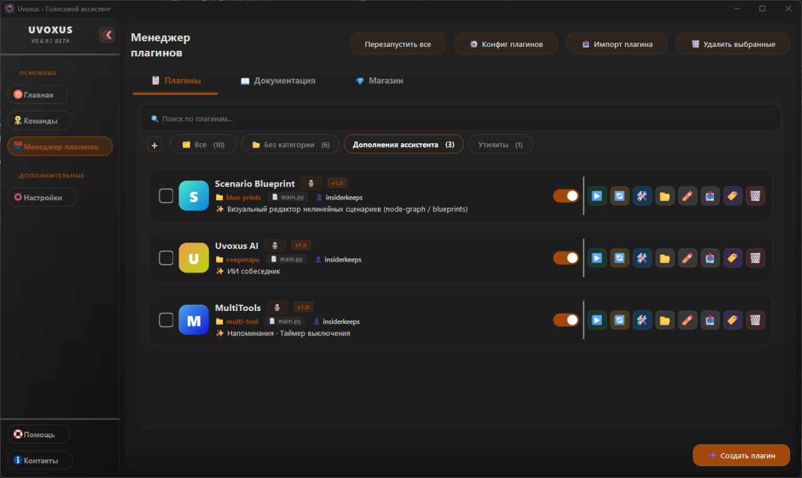
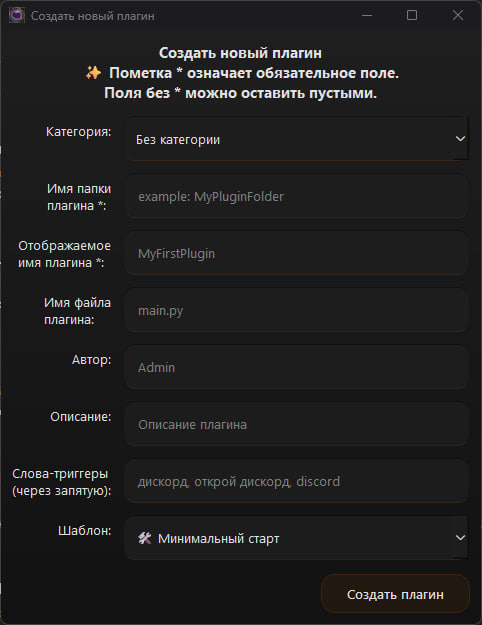

🚀 Plugin capabilities are nearly unlimited. Examples include:

- **System control** — empty Recycle Bin, adjust brightness and volume, monitor disks, and more.
- **Integration with external software** — control Spotify, OBS, smart home systems, and other applications.
- **Custom GUI interfaces** — create full-featured windows using PySide6 (weather dashboards, currency trackers, statistics panels, Docker tools, etc.).
- **Automation — clipboard** management, keyboard emulation, form auto-fill, text translation.
- **Internet integration** — news, cryptocurrency exchange rates, social media notifications, and other online data.
- **Background scenarios** — scheduled tasks such as backups, reminders, and automated system actions.

🛠 **Development Environment — Plugin Workshop**  
A built-in IDE for creating custom plugins:

- **Smart autocomplete for the assistant API** — type `api.` to see available methods.
- **Code validator** checks for restricted libraries and syntax errors before saving.
- **emplate library** (empty plugin, GUI window, network request, scheduler).
- **Full documentation** with convenient navigation.
- **Горячие клавиши:** Присутствует горячие клаиши для упрощения навигации и использования
- **Instant debugging:** Output Log displays plugin errors and messages in real time.

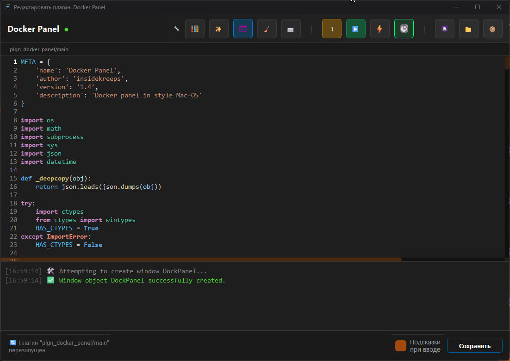

## 🛠 Visual Configuration Editor — Plugin Config UI

An intuitive interface for managing plugin settings without manually editing configuration files.

### Key Features

**🔄 Two Editing Modes**  
Instant switching between:
- **Visual Mode** — user-friendly fields, lists, and sliders  
- **JSON Mode** — direct editing of the configuration structure

**🌳 Tree-Based Parameter Structure**  
Displays nested objects and profiles  
*(for example: `profiles → Main → apps`)*, making complex configurations easier to navigate.

**🧠 Smart Field Types**  
The editor automatically detects the data type and provides the appropriate input:
- text fields  
- numeric inputs with steppers  
- arrays with syntax highlighting

**📦 Centralized Plugin List**  
A sidebar shows all installed modules and allows switching between their configurations with a single click.

**💾 Safe Saving**  
**Save** and **Cancel** buttons help prevent accidental changes while experimenting with settings.

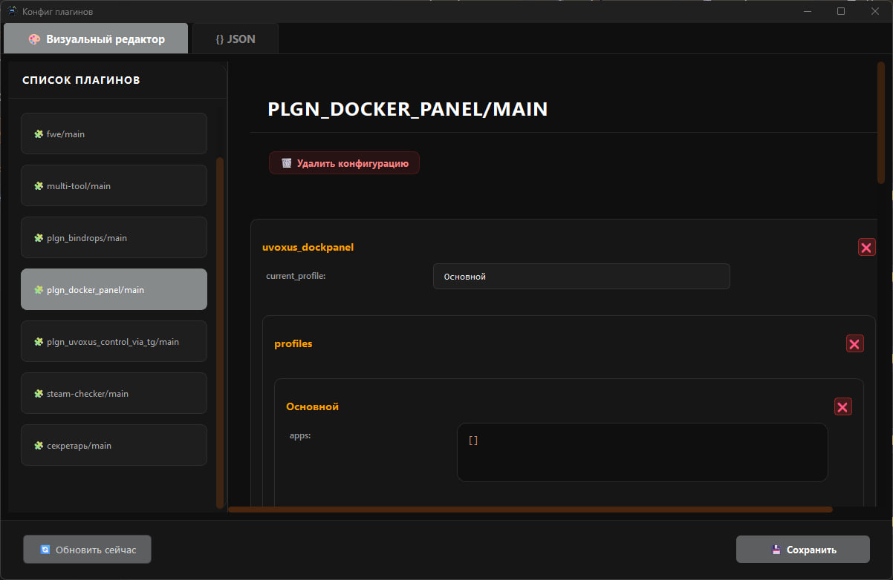

🛒 **Marketplace**  
Several ready-to-use plugins are available (BinDrop and others). Install them with one click — no manual file management required.

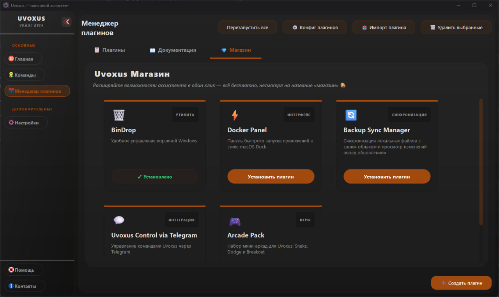

## 📊 Full Interface Overview

Below are the **main sections** of the app with a description of each screen:

<table style="border-spacing: 25px; text-align: center; width: 100%;">
  <tr>
    <td valign="top" width="33%">
      <b>🖥️ Main Screen</b> 
      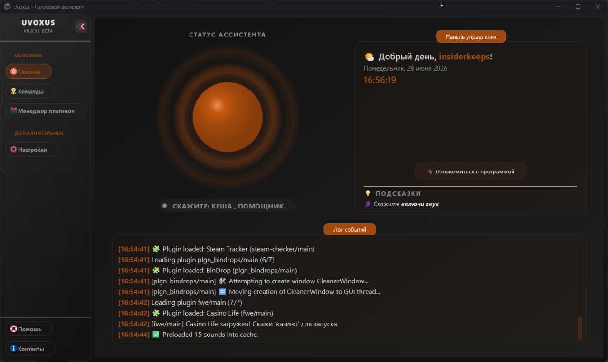 
      
Your control center. Displays the event log and the current assistant status.

    </td>
    <td valign="top" width="33%">
      <b>🗂️ Command Editor</b> 
      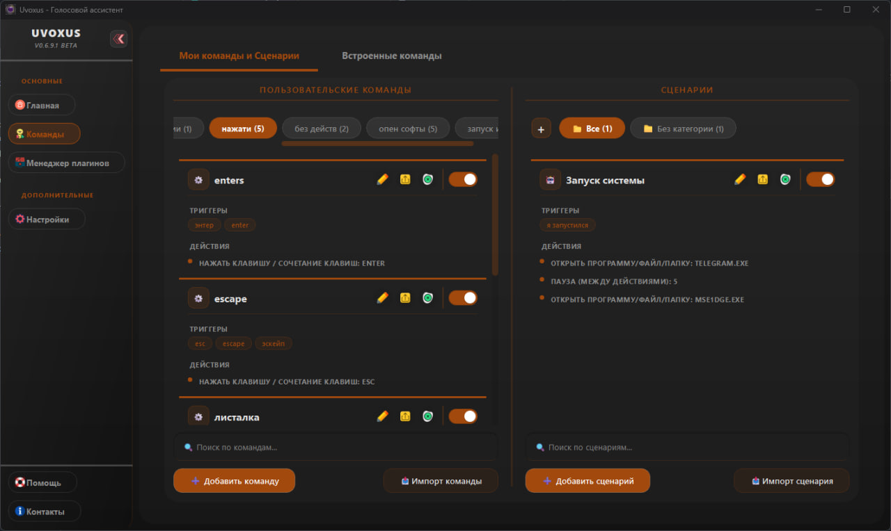 
      
Create, edit, and manage your commands and scenarios in a convenient visual interface.

    </td>
    <td valign="top" width="33%">
      <b>⚙️ Flexible Settings</b> 
      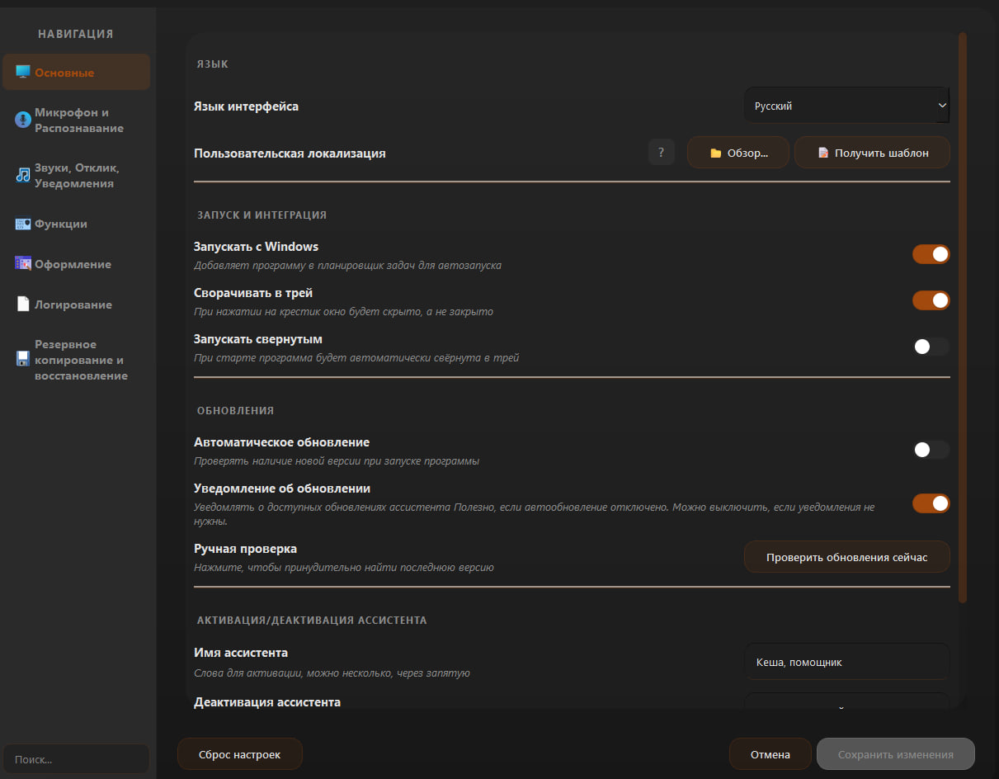 
      
Configure everything: from the assistant name and microphone to the recognition engine and system behavior.

    </td>
  </tr>
  <tr>
    <td valign="top" width="33%">
      <b>🚀 Built-in Commands</b> 
      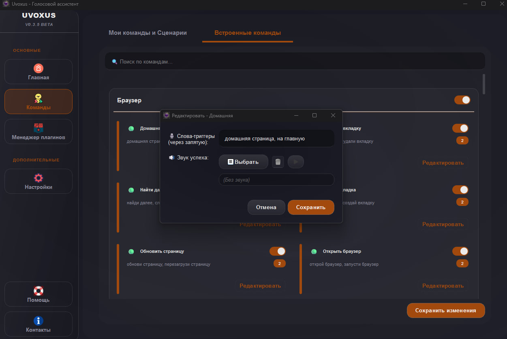 
      
Dozens of ready-to-use commands for system control. Enable, disable, or customize their triggers.

    </td>
    <td valign="top" width="33%">
      <b>🚀 Custom Commands</b> 
      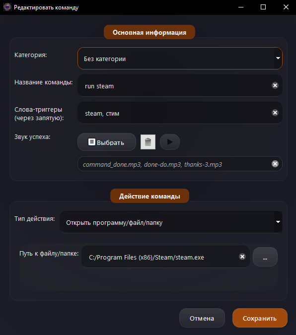 
      
Create your own simple commands to launch programs, open folders/websites, or simulate key presses.

    </td>
    <td valign="top" width="33%">
      <b>📜 Advanced Scenarios</b> 
      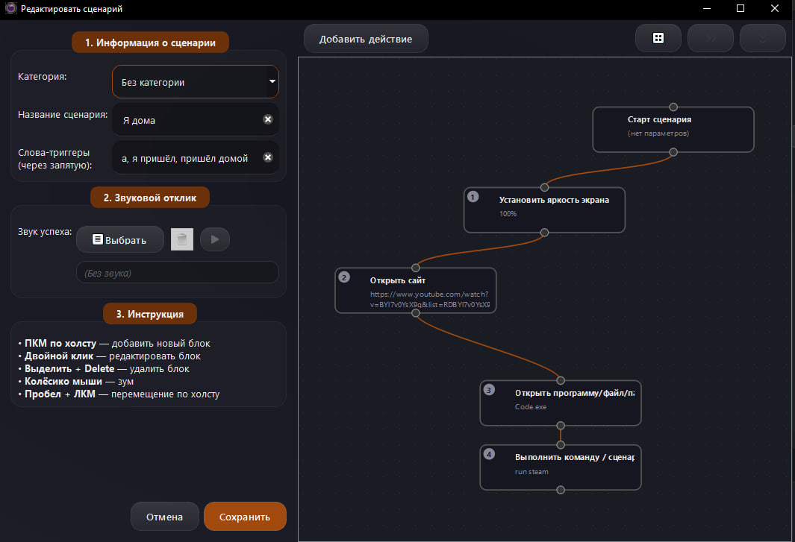 
      
Combine multiple actions into a single scenario. Change their order, add delays, and automate routine tasks.

    </td>
  </tr>
  <tr>
    <td valign="top" width="33%">
      <b>💡 Smart Recognition</b> 
      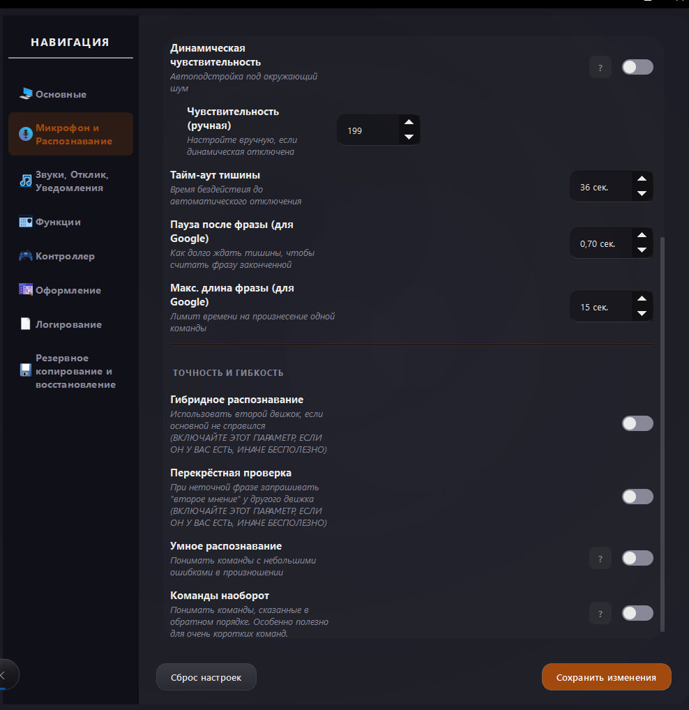 
      
With hybrid mode and fuzzy matching, the assistant understands you even if you misspeak.

    </td>
    <td valign="top" width="33%">
       <b>🎨 Theme Customization</b> 
      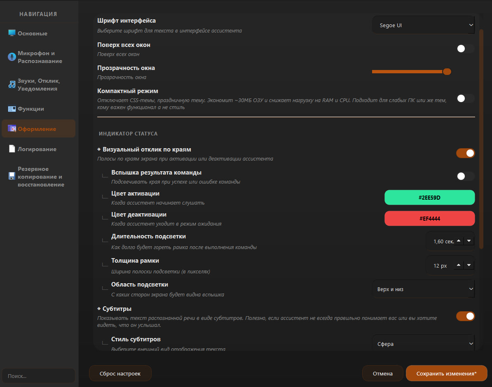 
      
Control the transparency and 'Always on Top' mode. Enable visual feedback on the edges of the screen when the assistant is activated and deactivated. Choose a ready-made color scheme or create your own so that the interface suits you perfectly.

    </td>
    <td valign="top" width="33%">
      <b>💭 Assistant Test Chat</b> 
      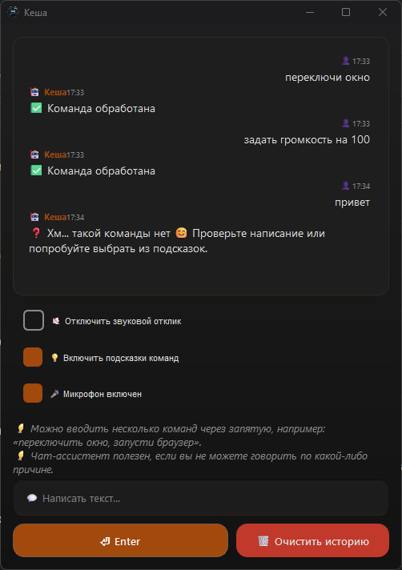 
      
If you cannot speak for any reason, you can type a command in the chat and it will be executed.

    </td>
  </tr>
  <tr>
    <td valign="top" width="33%">
      <b>⬇️ System Tray Menu</b> 
      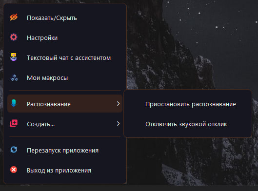 
      
A convenient system tray menu for quick interaction with the assistant.

    </td>
    <td valign="top" width="33%">
      <b>🎛 Event control and debugging</b> 
      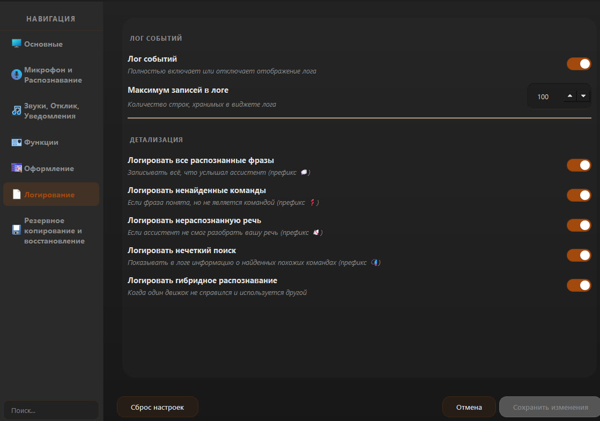 
      
Manage the assistant's work history: from a full record of all recognized phrases to logging system notifications and the operation of hybrid algorithms. Adjust the log archive depth for optimal performance and monitor the accuracy of your commands in real time.

    </td>
  </tr>
</table>

---

## 📊 Features & Capabilities Overview

| 🎯 **Parameter** | 📊 **Value** |
| :--- | :--- |
| **Built-in Commands** | 20+ ready-to-use commands |
| **Additional Features** | 12+ specialized tools |
| **Supported Languages** | 3+ languages (including English) |
| **Python API** | Full documentation + examples |
| **Marketplace Plugins** | Expandable library |
| **Audio Formats** | MP3, WAV, OGG |
| **Requirements** | Windows 10+ (64-bit) |

---

## �🛠️ Additional Features

- 📥 **Import & Export:** Save all settings, commands, and scenarios into a ZIP file for backup or transfer.
- 🎹 **Hotkeys:** Assign keyboard shortcuts to any command or scenario.
- 🎮 **Поддержка контроллера:** Управляйте курсором или включайте/выключайте распознавание ассистента с помощью контроллера.
- 🛠️ **Macro System:** Record actions and replay them with a single voice command.
- 🌐 **Browser Control:** Open websites, new tabs, switch between them, refresh, and scroll pages.
- ⌨️ **Keyboard Emulation:** Simulate key presses and complex shortcuts (`Ctrl + Shift + Esc`), and dictate text by voice.
- 💻 **Console Commands:** Execute system commands, including hidden mode without opening a console window.
- 📂 **Quick Access:** Instantly open system folders such as “Downloads,” “Documents,” “Pictures,” and more.
- 🗑️ **Empty Recycle Bin:** Clean your system with one command.
- 🖼️ **Screenshots:** Capture the screen using voice commands.
- 💡 **Dynamic Tips:** The main screen suggests random commands to help you explore features.
- 🎛️ **Power Management:** Switch Windows power plans (“Power Saver,” “Balanced,” “High Performance”).
- 🔆 **Brightness Control:** Adjust display brightness (on supported devices).

---

## 🔊 Customize Voice Responses

Make the assistant unique by adding custom response sounds. You can assign a unique audio file or a full set of sounds to **any command / scenario**.

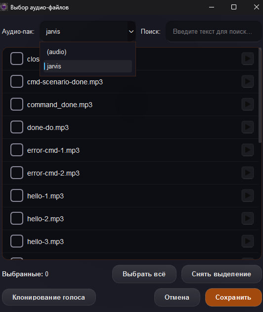

### Features

- 🎵 Assign sounds to both built-in and custom commands.
- 🎤 Use your own files: supported formats include `MP3`, `WAV`, `OGG`.
- 🎲 Random responses: assign multiple sounds to one action and let the assistant choose randomly.
- 📁 Audio packs: organize sounds into folders inside the `audio` directory for easy navigation.

### How to Set It Up

1. Locate the `audio` folder next to the program’s `.exe` file.
2. Copy your sound files there (you can create subfolders for organization).
3. In the command or scenario editor, click **“Select.”**
4. Save changes. The assistant will now respond with your custom audio.

💡 Tip: Record short phrases like “Done!”, “Executing!”, or “As you wish!” and assign them to frequently used commands for a more engaging experience.

---

## 🖥️ Supported Systems

| System | Support | Notes |
| :--- | :---: | :--- |
| Linux | ❌ | Not supported |
| macOS | ❌ | Not planned |
| Windows 7 / 8 | ❌ | Not planned |
| **Windows 10** | ✔️ | **Fully supported** |
| **Windows 11** | ✔️ | **Recommended** |

---

## 📥 Download

| 📂 Resource | 🌐 Link |
| :--- | :--- |
| **Latest Version** | [**Download from GitHub Releases**](https://github.com/Farmerok/Uvoxus-Voice-Assistant/releases/latest) |
| All Releases | [Version History](https://github.com/Farmerok/Uvoxus-Voice-Assistant/releases) |

---

## ⚠️ Important Information

### Antivirus Warning

**This is a false positive.** Uvoxus is a complex application that deeply interacts with the operating system:
- Simulates key presses
- Manages application windows
- Starts and terminates processes

Such behavior may appear suspicious to antivirus software, especially since a free project does not use an expensive digital signature.

✅ **If you downloaded the program from the official GitHub page, it is safe.** Simply add the assistant's folder to your antivirus exclusions.

### Running as Administrator Is Required

Administrator privileges are required so the assistant can:
- Properly control programs running as administrator
- Perform system-level operations without errors or failures
- Access protected system resources

---

## ⚙️ First Launch & Setup

1. **Download and extract:** Download the latest version archive. Create a separate folder (for example, `C:\Uvoxus`) and extract the contents there.
2. **Launch the assistant:** Double-click `Uvoxus.exe`.
3. **Open Settings:** Go to the **“Settings”** tab.
4. **Select microphone and adjust sensitivity:** In the “Audio & Sensitivity” section, select your main device under **“Active Microphone.”** This is the most important step. Adjust sensitivity according to your voice and background noise.
5. **Set activation name:** In the main settings section, enter one or more activation names (for example, `Jarvis`, `Assistant`).
6. **Save changes.**
7. **Test:** Return to the **“Home”** tab and say the assistant’s name. The status should change to **“LISTENING…”**, and the animated indicator should respond to your voice.

✨ Done. You can now control your PC using voice commands. Try saying:  
*“Open calculator”* or *“What’s the current volume?”*

💡 Tip: For best recognition accuracy, use the **Microphone Setup Wizard** in Settings. It helps you visually fine-tune sensitivity based on your voice and background noise.

---

## 🌟 Tips & Recommendations

### For Beginners
- **Don't fear mistakes** — use fuzzy matching to improve recognition.
- **Start with built-in commands** — they're fully configured and ready to use.
- **Experiment** — create your own commands and scenarios to find what works best for you.

### For Advanced Users
- **Build scenarios** — combine commands to automate complex workflows.
- **Develop plugins** — leverage the Uvoxus API to extend functionality for your needs.

---

## 📞 Help & Feedback

If you encounter a bug, an incomplete feature, or have an idea for improvement, please report it!

- **Telegram:** [Telegram](https://t.me/insiderkeeps)  
- **Issues:** [Create Issue](https://github.com/Farmerok/Uvoxus-Voice-Assistant/issues/new)